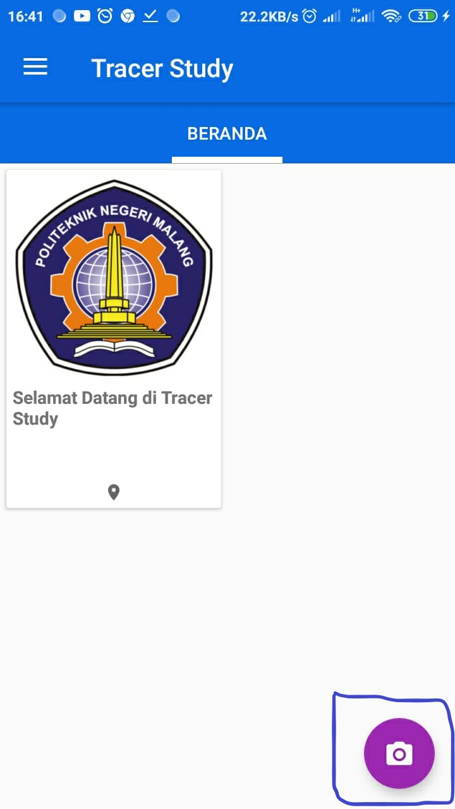
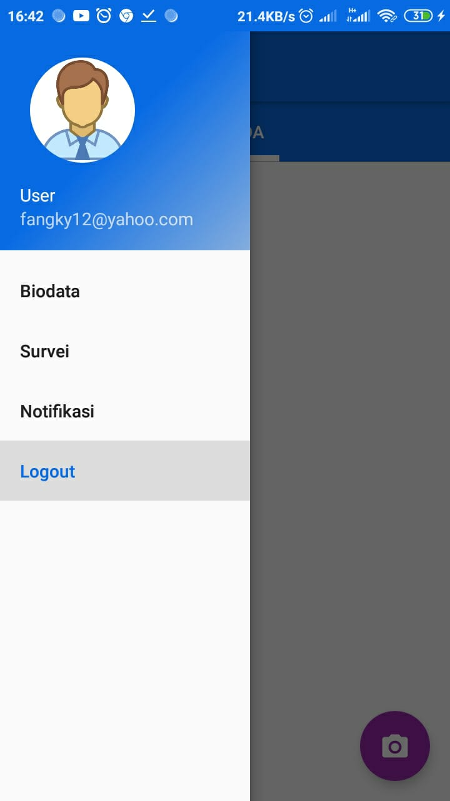

# Quiz 2 

## Soal 1

- View Model
  
  

- Data Binding
  
  

- Fragment
  
  

- Navigation
  
  

## soal 2

    Data Binding adalah support library yang memungkinkan Anda mengikat komponen UI dalam tata letak ke sumber data di aplikasi Anda menggunakan format deklaratif, bukan secara terprogram.

    Tata letak sering ditentukan dalam aktivitas dengan kode yang memanggil metode framework UI. Misalnya, kode di bawah ini memanggil findViewById() untuk menemukan widget TextView dan mengikatnya ke properti userName variabel viewModel dengan data.

https://medium.com/gits-indonesia/android-data-binding-7edf75b16067

    ViewModel adalah Abstraksi dari Tampilan yang akan disambungkan melalui Model, sehingga mampu menampilkannya sesuai ekspektasi. 

https://qastack.id/software/104889/what-is-the-difference-between-the-controller-in-mvc-and-viewmodel-in-mvvm, https://medium.com/@yogiwisesa/android-mvvm-architecture-7b12a2190028

## soal 3

    Activity merupakan salah satu komponen yang ada di Android Studio yang berfungsi untuk menampilkan user interface (UI) dari aplikasi yang akan dibuat, biasanya diletakkan pada “setcontentview”. Bukan hanya menampilkan UI, activity juga digunakan untuk melakukan berbagai kegiatan yang diperlukan di dalam aplikasi tersebut seperti berpindah dari satu tampilan ke tampilan lainnya, menjalankan program lain, dan masih banyak lagi yang dapat dilakukan di dalam sebuah activity.

    Fragment merupakan salah satu komponen pada Android Studio dengan fungsi yang hampir sama seperti activity tetapi memiliki “lifecycle” yang berbeda. Fragment merupakan bagian dari sebuah activity yang mana sebuah fragment tidak akan ada bila tidak ada sebuah activity karena fragment membutuhkan akses dari activity untuk dapat dijalankan.

https://socs.binus.ac.id/2017/09/26/activity-dan-fragment-di-android-studio/

